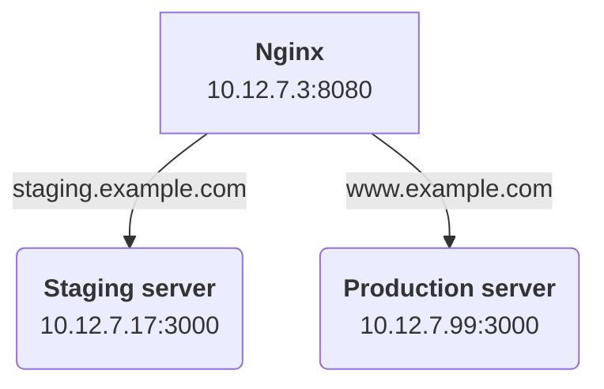

## A little context

Applications usually require significant customization to interact with a plethora of different services and components.  As such, they are most often shipped in their own docker image.  Services like reverse, proxies, caches and databases however are often run from *official* or *stock* docker images.  Many services like nginx, postgres, etc. don't requre one to build custom container images.  They come ready made and only require a little configuration to work for you.

-----

# Deploying a reverse proxy with docker

In this section, we'll be deploying a reverse proxy ([NGINX][docker-nginx]) as a container to proxy requests it receives on port **80** to 1 of 2 application servers depending on the request URL.  Requests to **staging.example.com** will be proxied to the host running the staging application server and **www.example.com** will to proxied to the production host.


#### Tools and skills you'll need
* Docker CE installed on your system
* Familiarity with NGINX **conf** files


#### The assumptions we'll make

The host where NGINX will run must be your own machine or one that is otherwise accessible to you via SSH.  The staging and production application servers must be accessible to the host running NGINX.  IPs are provided but are arbitrary.  Substitute them for your own accordingly.

* NGINX is will run on host **10.12.7.3** and will receive requests from port **8080** of that host
* Staging server is running on host **10.12.7.17** and bound to port **3001**
* Production server us running host **10.12.7.99** and bound to port **3000**

Find below a minimal network diagram demonstrating the relationship between hosts.




## Our reverse proxy configuration

There is more than one way with NGINX to route requests to different hosts.  In our case, given the relative simplicity of our network, we've opted for defining 2 servers, one for each application server.

Our staging server in NGINX must accept requests destined for **staging.example.com** and forward them to **10.12.7.17:3001**.
```nginx
server {
  # The host to which this NGINX server should respond
  server_name staging.example.com;

  # / will apply this location block to all request paths
  location / {
    # Proxy request to this host:port
    proxy_pass http://10.12.7.17:3001;
  }
}
```

Our production server in NGINX must accept requests destined for **www.example.com** and forward them to **10.12.7.99:3000**.

```nginx
server {
  server_name www.example.com;
  location / {
    proxy_pass http://10.12.7.99:3000;
  }
}
```


#### Our complete NGINX configuration
Find below the complete NGINX configuration we need to achieve our goals.  It's quite thin but does the job.  For more robust configurations, we might include HTTPS redirects, serving static content, logging, etc.  For more information on building thorough NGINX configs, consult the [NGINX documentation][nginx-documentation].

```nginx
# /home/opiation/nginx.conf

http {
  # Staging server
  server {
    server_name staging.example.com;
    location / {
      proxy_pass http://10.12.7.17:3001;
    }
  }

  # Production server
  server {
    server_name www.example.com;
    location / {
      proxy_pass http://10.12.7.99:3000;
    }
  }
}
```


## Deploying the NGINX container
We now have what we need to deploy an NGINX container.

TODO: Include details about each `docker run` option used

```bash
# deploy-nginx-container.sh

docker run \
  --detach
  --name=nginx-container
  --publish=0.0.0.0:8080:80
  --volume=$PWD/nginx.conf:/etc/nginx/nginx.conf:ro
  nginx:1.13-alpine
```

[docker-nginx]: https://hub.docker.com/_/nginx/
[nginx-documentation]: http://nginx.org/en/docs/
